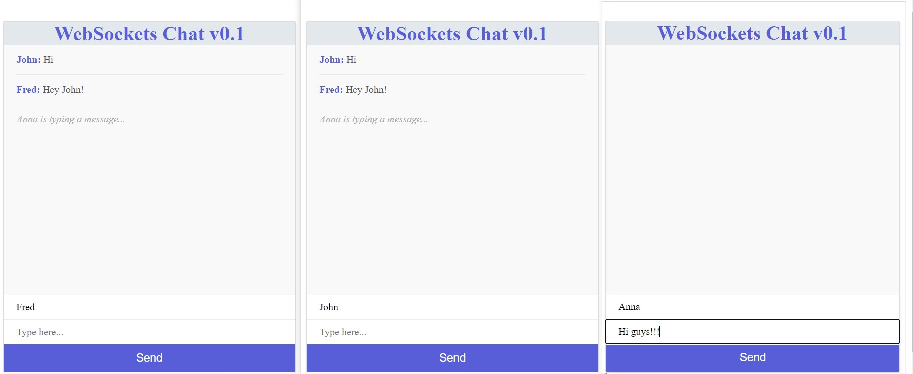

## WebSockets Chat App

This app consists in a basic chat app implementation with Web Sockets using socket.io library.
Users are able to connect to the localhost Express server, which assigns a unique socket id to each user, allowing them to send and receive messages in real time.

## Built With
- Node (JS Runtime)
- Express.js (Web Server)
- Socket.io (WebSockets library)
- HTML / CSS

## App Screenshot




## Setup instructions

Open a terminal window, go to the location you'd like to add the project and then run the commands below.

```console
git clone https://github.com/noomdalv/websockets_chat.git
```

```console
cd websockets_chat
```

```console
npm install
```

```console
nodemon index

```
### Special Thanks to [The Net Ninja](https://www.youtube.com/c/TheNetNinja) for his amazing tutorial.

## Author

👤 **Vladimir Luna**

- Github: [@noomdalv](https://github.com/noomdalv)


## 📝 License

This project is [MIT](lic.url) licensed.
